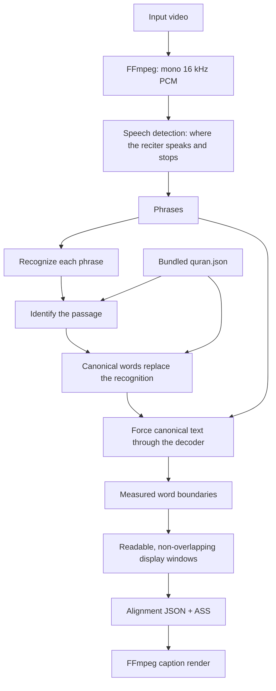

# transcribe-quran

Create canonical Qur'an word-by-word captions from a recitation video, entirely
on the local machine.

```bash
npx transcribe-quran ./video.mp4
```

The command extracts the video's audio with FFmpeg, transcribes short
overlapping windows with the Qur'an-tuned Tarteel Whisper model, matches the
recognized words against the bundled canonical Qur'an, creates an alignment
JSON and RTL ASS subtitles, then burns the captions into a new video. Short
windows make the recognizer substantially more reliable for slow, highly
melodic reciters such as Abdul Basit.

No OpenAI key, cloud transcription service, Python runtime, Qari selection, or
manual verse selection is required. The model is downloaded from Hugging Face
once and is cached locally; inference after that is offline.

## Requirements

- Node.js 20 or newer
- FFmpeg with the `ass`/libass video filter (`ffmpeg -filters | grep ass`)
- Internet access on the first run only, to download the q8 ONNX model

## Install and run

From this repository:

```bash
npm install
npm run build
node dist/cli.js ./video.mp4
```

Once this package is published to npm, the intended command is:

```bash
npx transcribe-quran ./video.mp4
```

For `video.mp4`, the default outputs are:

- `video.transcribed.mp4` — captioned video
- `video.quran-captions.ass` — editable subtitles
- `video.quran-alignment.json` — canonical word timing and translations

Run `npx transcribe-quran --help` for all options. Common examples:

```bash
# Generate alignment and subtitles without rendering a new video
npx transcribe-quran ./video.mp4 --no-burn

# Use a different included verse translation
npx transcribe-quran ./video.mp4 --translation abdulHaleem

# Show groups of up to four Arabic words (the default is one word)
npx transcribe-quran ./video.mp4 --words 4

# Increase Arabic and English caption sizes
npx transcribe-quran ./video.mp4 --font-size 110 --translation-font-size 42

# Choose installed font families
npx transcribe-quran ./video.mp4 --font Amiri --translation-font Georgia

# Open the local browser editor (video path optional)
npx transcribe-quran --ui ./video.mp4
npx transcribe-quran --ui

# Require a model that is already present in the local cache
npx transcribe-quran ./video.mp4 --offline

# Choose output paths
npx transcribe-quran ./video.mp4 \
  --output ./result.mp4 \
  --alignment ./result.json \
  --subtitles ./result.ass

# Override FPS only if FFprobe cannot read the source video, and choose the
# minimum number of actual video frames a caption should remain visible.
# A short breath does not end a word unless quiet audio lasts this long.
npx transcribe-quran ./video.mp4 --frame-rate 25 --min-caption-frames 3 --speech-pause 0.60

# Caption reading time: never show a word for less than half a second, let the
# last word of a phrase linger into the silence, and cap how far a caption may
# lag the audio in order to stay readable.
npx transcribe-quran ./video.mp4 \
  --min-word-seconds 0.50 --caption-hold 0.35 --max-caption-drift 0.40

# Recognize each phrase at a different speed, undone before captions are timed.
# The default of 1.0 leaves the audio alone; slowing it down measurably hurts.
npx transcribe-quran ./video.mp4 --tempo 1.0
```

Available verse translations are `saheehInternational`, `abdulHaleem`,
`taqiUsmani`, `pickthall`, and `yusufAli`. Each aligned word also contains its
word-level English translation.

Arabic captions show one word at a time by default. `--words <count>` groups up
to that many consecutive words within an ayah. Every group is laid out in
Qur'anic reading order: the earliest word is on the right and reading proceeds
to the left. The Arabic and English caption pair is centered horizontally and
vertically in the video by default, with a 40-unit gap between the two lines.
Use `--caption-gap <number>` to change that vertical spacing.

Use `--font-size` for Arabic and `--translation-font-size` for English. The
defaults are 310 and 92 respectively. Use `--font` and `--translation-font` to
choose font families; the defaults are Amiri Quran and Arial. The font must be
installed on the system or available in the renderer's fonts directory.

## Browser editor

`--ui` starts a local editor at `127.0.0.1`. Pass a video path to load it
immediately, or omit the path and use the drag-and-drop area or file picker in
the browser. The editor previews synchronized Qur'an captions, lets you drag
caption layers, resize them, change the current caption settings, search
installed/bundled fonts, import local `.ttf`, `.otf`, `.woff`, or `.woff2`
fonts, save a project file, add text/image overlays, and export ASS subtitles
or a rendered MP4. Click any word on the caption timeline to manually edit its
Arabic text, translation, timing, visibility, or restore the automatic match;
drag the edges of a timeline block for precise timing changes. Use
`--port <number>` to choose a port and `--no-open` to keep the browser from
opening automatically.

## How it works

The recitation drives the pipeline, one phrase at a time.

**1. Find where the reciter speaks and stops.** The audio is segmented into
phrases by vocal energy. The noise floor is measured over roughly a minute
either side of each point, so continuous recitation cannot mistake its own
quietest breath for silence, and the recording level may drift without breaking
detection. A short breath does not end a phrase; only quiet lasting longer than
`--speech-pause` does. A phrase longer than the model's audio window is divided
at its quietest interior moment, which lands the cut between words.

**2. Recognize each phrase.** Every phrase is transcribed on its own, so the
model hears one complete thought with nothing else in the window.

**3. Identify the passage.** Recognition is used only to find the place in the
Qur'an, never to caption. Exact and fuzzy anchors locate candidate passages in
the 77,429-word corpus, and a continuity-aware dynamic-programming alignment
maps the recitation onto canonical positions. Identification runs over the
whole transcript at once rather than phrase by phrase: a two-word phrase is
ambiguous alone and unmistakable in the context of the recitation around it.
Each phrase then takes the passage the matcher placed inside its span of time.
Stray matches elsewhere in the Qur'an are discarded rather than allowed to
stretch a phrase across thousands of words.

**4. Replace the recognition with the canonical text.** Once a phrase's passage
is known, every displayed word — Arabic, word translation, verse translation —
comes from `quran.json`. The recognizer's own text is thrown away. Words it
misheard or skipped entirely are therefore still captioned correctly, because
the canonical text between two confident anchors is certain.

**5. Measure each word against the audio.** The canonical words are fed back
through the decoder as forced text, and each word's boundaries are read off the
cross-attention. This is the important step: the timing of every word is
*measured*, including words the recognizer never produced. Nothing is spread
evenly or guessed. A word that closes a phrase is held until the voice stops,
so an elongated ending stays on screen for as long as the reciter sustains it.

When the recognizer cuts an ayah short, the remaining canonical words of that
verse are offered to the aligner as well, and the audio decides: words that were
recited receive real boundaries, and words that were not collapse onto an
instant and are discarded.

**6. Put the timings back on the original clock.** `--tempo` recognizes each
phrase at a different speed, and the measured timings are converted back by the
same factor. The default is `1.0`, meaning no change, because slowing the audio
measurably *reduces* accuracy — Qur'anic recitation is already slower than the
speech the model was trained on. Measured word error rate on a reference clip:
1.0x 27.5%, 0.75x 37.5%, 0.65x 50.0%, 0.5x 97.5%. Values above 1.0 are roughly
neutral to slightly better.

If forced alignment is unavailable — a model exported without alignment heads,
for instance — the phrase falls back to spreading its passage evenly, and the
run reports how many phrases that affected.

## Reading time

A caption shown for two or three frames registers as a flicker rather than a
word, which is why quickly recited words can look skipped. Every caption is
kept on screen for at least half a second, and the last word of a phrase
lingers a further 0.35 seconds into the silence that follows.

Time for a short word is taken from neighbouring silence first, because that
costs nothing. Only when there is no silence to borrow does a caption delay the
one after it, and that delay is capped at 0.40 seconds so captions cannot drift
away from the recitation; they re-synchronise at the next natural pause. If the
reciter is genuinely too fast to hold a word for the full minimum without
lagging, the caption is shortened rather than allowed to drift, and the run
reports how many times that happened. A caption is never shown before its word
is recited, since appearing early is more jarring than lingering late.

Captions are laid out in a separate, non-overlapping display window that is
never shorter than `--min-caption-frames` actual video frames, derived from the
real video FPS rather than a Qari or ayah rule. Use `--frame-rate` only when
FFprobe cannot read the file, and `--min-word-seconds`, `--caption-hold`, and
`--max-caption-drift` to change the reading policy — or the **Speech timing**
section of the browser editor.

Every run reports what share of the recitation ended up captioned, measured on
the finished display windows rather than assumed. The alignment JSON records
the package version, FPS, phrase counts, how many phrases were forced-aligned,
caption coverage, and any captions held below the minimum, for audit.

In the editor, open **Layout → Transition** to choose separate Arabic or
English enter/exit effects (Fade, Rise, Drop, or Zoom) and their durations.
The preview and exported ASS subtitles use the same effect. Transitions never
alter the recognized speech interval; very short display windows shorten an
effect rather than hiding a word.

Matching is deliberately confidence-gated. If the audio is not Qur'an, is too
unclear, or is too ambiguous, the command refuses to create captions rather
than inventing an ayah. Identical short phrases cannot always be uniquely
located without surrounding recitation; longer context resolves them
automatically.



## Offline behavior

The default q8 model is
[`Sharjeelbaig/whisper-tiny-ar-quran-onnx`](https://huggingface.co/Sharjeelbaig/whisper-tiny-ar-quran-onnx).
Transformers.js stores it in the operating system cache. Run once while online,
then add `--offline` to guarantee that remote model access is disabled.

The cache location is:

- macOS: `~/Library/Caches/transcribe-quran`
- Linux: `$XDG_CACHE_HOME/transcribe-quran` or `~/.cache/transcribe-quran`
- Windows: `%LOCALAPPDATA%\transcribe-quran\Cache`

## Development

```bash
npm run check
npm test
BALEELA_FIXTURE=/path/to/clip.mp4 npm run test:baleela
npm run build
npm pack --dry-run
```

The application runtime is TypeScript/JavaScript only. The Python file under
`scripts/` is a development-only, reproducible conversion tool for producing
the ONNX model artifact; users do not run it.

## Accuracy and responsible use

The tool is designed to prevent ASR spelling errors from entering the final
captions by always displaying canonical corpus text. Automatic timing and
passage detection can still be wrong, especially with heavy background sound,
non-recitation speech, very short repeated phrases, unusual edits, or recitation
that omits/repeats words. Review generated religious content before publishing.

See [THIRD_PARTY_NOTICES.md](./THIRD_PARTY_NOTICES.md) for model, Qur'an corpus,
translation, and font attribution.
