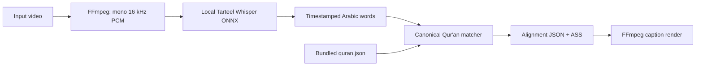

# transcribe-quran

Create canonical Qur'an word-by-word captions from a recitation video, entirely
on the local machine.

```bash
npx transcribe-quran ./video.mp4
```

The command extracts the video's audio with FFmpeg, transcribes short
overlapping windows with the Qur'an-tuned Tarteel Whisper model, matches the
recognized words against the bundled canonical Qur'an, creates an alignment
JSON and RTL ASS subtitles, then burns the captions into a new video. Short
windows make the recognizer substantially more reliable for slow, highly
melodic reciters such as Abdul Basit.

No OpenAI key, cloud transcription service, Python runtime, Qari selection, or
manual verse selection is required. The model is downloaded from Hugging Face
once and is cached locally; inference after that is offline.

## Requirements

- Node.js 20 or newer
- FFmpeg with the `ass`/libass video filter (`ffmpeg -filters | grep ass`)
- Internet access on the first run only, to download the q8 ONNX model

## Install and run

From this repository:

```bash
npm install
npm run build
node dist/cli.js ./video.mp4
```

Once this package is published to npm, the intended command is:

```bash
npx transcribe-quran ./video.mp4
```

For `video.mp4`, the default outputs are:

- `video.transcribed.mp4` — captioned video
- `video.quran-captions.ass` — editable subtitles
- `video.quran-alignment.json` — canonical word timing and translations

Run `npx transcribe-quran --help` for all options. Common examples:

```bash
# Generate alignment and subtitles without rendering a new video
npx transcribe-quran ./video.mp4 --no-burn

# Use a different included verse translation
npx transcribe-quran ./video.mp4 --translation abdulHaleem

# Show groups of up to four Arabic words (the default is one word)
npx transcribe-quran ./video.mp4 --words 4

# Increase Arabic and English caption sizes
npx transcribe-quran ./video.mp4 --font-size 110 --translation-font-size 42

# Choose installed font families
npx transcribe-quran ./video.mp4 --font Amiri --translation-font Georgia

# Require a model that is already present in the local cache
npx transcribe-quran ./video.mp4 --offline

# Choose output paths
npx transcribe-quran ./video.mp4 \
  --output ./result.mp4 \
  --alignment ./result.json \
  --subtitles ./result.ass
```

Available verse translations are `saheehInternational`, `abdulHaleem`,
`taqiUsmani`, `pickthall`, and `yusufAli`. Each aligned word also contains its
word-level English translation.

Arabic captions show one word at a time by default. `--words <count>` groups up
to that many consecutive words within an ayah. Every group is laid out in
Qur'anic reading order: the earliest word is on the right and reading proceeds
to the left. The Arabic and English caption pair is centered horizontally and
vertically in the video by default.

Use `--font-size` for Arabic and `--translation-font-size` for English. The
defaults are 88 and 34 respectively. Use `--font` and `--translation-font` to
choose font families; the defaults are Noto Naskh Arabic and Arial. The font
must be installed on the system or available in the renderer's fonts directory.

## How matching works

The recognizer's text is never displayed directly. It is normalized only for
search, and exact/fuzzy anchors locate likely passages in the 77,429-word
canonical corpus. A continuity-aware dynamic-programming alignment then maps
the timestamps to Qur'an words. Display Arabic, word translations, and verse
translations always come from `quran.json`.

Whisper timestamp outliers are rejected when a single word spans an impossible
portion of an inference window. Missing-word timing is inferred only across
short, plausible gaps; long pauses are left uncaptioned so a previous verse
cannot bleed into the next passage. Final ayah words are additionally checked
against the local audio tail so elongated endings such as `ٱلضَّآلِّينَ` do not
disappear before the reciter finishes.

Matching is deliberately confidence-gated. If the audio is not Qur'an, is too
unclear, or is too ambiguous, the command refuses to create captions rather
than inventing an ayah. Identical short phrases cannot always be uniquely
located without surrounding recitation; longer context resolves them
automatically.



## Offline behavior

The default q8 model is
[`Sharjeelbaig/whisper-tiny-ar-quran-onnx`](https://huggingface.co/Sharjeelbaig/whisper-tiny-ar-quran-onnx).
Transformers.js stores it in the operating system cache. Run once while online,
then add `--offline` to guarantee that remote model access is disabled.

The cache location is:

- macOS: `~/Library/Caches/transcribe-quran`
- Linux: `$XDG_CACHE_HOME/transcribe-quran` or `~/.cache/transcribe-quran`
- Windows: `%LOCALAPPDATA%\transcribe-quran\Cache`

## Development

```bash
npm run check
npm test
npm run build
npm pack --dry-run
```

The application runtime is TypeScript/JavaScript only. The Python file under
`scripts/` is a development-only, reproducible conversion tool for producing
the ONNX model artifact; users do not run it.

## Accuracy and responsible use

The tool is designed to prevent ASR spelling errors from entering the final
captions by always displaying canonical corpus text. Automatic timing and
passage detection can still be wrong, especially with heavy background sound,
non-recitation speech, very short repeated phrases, unusual edits, or recitation
that omits/repeats words. Review generated religious content before publishing.

See [THIRD_PARTY_NOTICES.md](./THIRD_PARTY_NOTICES.md) for model, Qur'an corpus,
translation, and font attribution.
